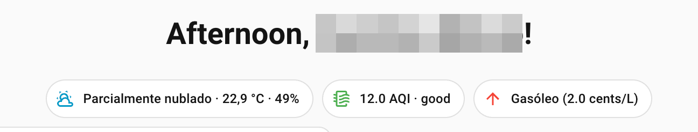

# FuelVariationScraping-PT 🇵🇹

## Variação de Combustíveis em Portugal para Home Assistant

Uma integração simples para o Home Assistant que te dá a informação mais recente sobre a variação de preços dos combustíveis em **Portugal**.

### O que faz?

Esta ferramenta faz o "scrape" à página da próxima semana do site preçodoscombustíveis.pt e extrai os valores de variação previstos.
Com ela, podes saber se o preço da gasolina e do gasóleo vai subir, descer ou manter-se, tudo isto no teu dashboard do Home Assistant!

- **Extrai o valor da variação** (+2.5 cêntimos, por exemplo).
- **Identifica a tendência** (Subir, Descer, ou Manter).
- **Disponibiliza os dados** como sensores na tua instalação do Home Assistant.

### Porquê instalar no HA?

Se já utilizas o Home Assistant para centralizar toda a informação da tua casa, porque não adicionar também os preços dos combustíveis?
Com esta integração, podes criar automações úteis, como:

- Receber uma notificação na manhã de domingo a avisar se os preços vão subir na segunda-feira.
- Ter um cartão no teu dashboard que te mostra a tendência atual, para que possas decidir se vale a pena atestar o carro este fim de semana.
- Integrar a informação em rotinas de poupança ou planeamento.

### Créditos

Esta integração extrai os dados diretamente de https://precocombustiveis.pt/, um recurso valioso e transparente para todos os consumidores.
Visita o site para mais detalhes!

## Instalar no HA

### Instalação manual

Segue estes passos:

1.  Acede ao `File editor` (ou outro método de gestão de ficheiros) no Home Assistant.
2.  Navega até à pasta `custom_components/` (geralmente localizada na pasta de configuração do Home Assistant).
3.  Cria uma nova pasta com o nome `fuelvariationscrapingpt`.
4.  Copia todos os ficheiros desta integração para a pasta `custom_components/fuelvariationscrapingpt/` que acabaste de criar.
5.  Adiciona o seguinte bloco ao ficheiro de configurações - `homeassistant/configuration.yaml`:
    ```yaml
    sensor:
      - platform: fuelvariationscrapingpt
    ```
6.  Reinicia o Home Assistant.

## Utilização



Aqui está um exemplo de como podes exibir a informação da variação dos combustíveis no teu dashboard do Home Assistant:

> ***Note***
> 
> Neste exemplo uso a coleção [Mushroom for Home Assistant](https://github.com/piitaya/lovelace-mushroom/tree/main).

```yaml
views:
  - title: Home
    badges:
      - type: custom:mushroom-template-badge
        content: >-
          Gasóleo ({{ state_attr('sensor.fuel_variation_gasoleo', 'variacao_cent_litro')
          }} cents/L)
        icon: |-
          
            mdi:arrow-up
          
            mdi:arrow-down
          
        color: |-
          
            red
          
            green
          
        entity: sensor.fuel_variation_gasoleo
```
