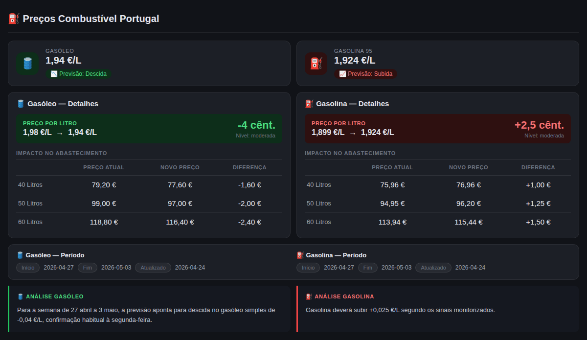

# FuelVariationScraping-PT 🇵🇹

[![hacs][hacs-badge]][hacs-url]
[![github-license][license-badge]][license-url]
[![release][release-badge]][release-url]
[![github-discussions][discussions-badge]][discussions-url]
[![github-issues][issues-badge]][issues-url]
[![suggest][suggest-badge]][suggest-url] 

[](https://ko-fi.com/I2I41KY28L)

## Variação de Combustíveis em Portugal para Home Assistant

Uma integração simples para o Home Assistant que te dá a informação mais recente sobre a variação de preços dos combustíveis em **Portugal**.

### O que faz?

Esta ferramenta faz o "scrape" à página da próxima semana do site preçodoscombustíveis.pt e extrai os valores de variação previstos.
Com ela, podes saber se o preço da gasolina e do gasóleo vai subir, descer ou manter-se, tudo isto no teu dashboard do Home Assistant!

- **Extrai o valor da variação prevista** (em cêntimos por litro).
- **Identifica a tendência** (`sobe`, `desce` ou `neutro`).
- **Classifica a intensidade da variação** (`ligeira`, `moderada` ou `forte`).
- **Calcula preço de referência e preço final estimado** por litro.
- **Calcula impacto no abastecimento** para depósitos de 40L, 50L e 60L.
- **Expõe janela da previsão e data de atualização** para automações no HA.

### Porquê instalar no HA?

Se já utilizas o Home Assistant para centralizar toda a informação da tua casa, porque não adicionar também os preços dos combustíveis?
Com esta integração, podes criar automações úteis, como:

- Receber uma notificação na manhã de domingo a avisar se os preços vão subir na segunda-feira.
- Ter um cartão no teu dashboard que te mostra a tendência atual, para que possas decidir se vale a pena atestar o carro este fim de semana.
- Integrar a informação em rotinas de poupança ou planeamento.

### Créditos

Esta integração extrai os dados diretamente de https://precocombustiveis.pt/, um recurso valioso e transparente para todos os consumidores.
Visita o site para mais detalhes!

## Instalar no HA

### HACS

[](https://my.home-assistant.io/redirect/hacs_repository/?owner=carolinabrasio&repository=fuelvariationscrapingpt&category=integration)

_ou_

Segue estes passos:

1. No Home Assistant, vai a HACS > Integrações.
2. Clica nos três pontos no canto superior direito e seleciona "Custom repositories".
3. Adiciona o URL do repositório GitHub e escolhe a categoria "Integration".

### Instalação manual

Segue estes passos:

1.  Acede ao `File editor` (ou outro método de gestão de ficheiros) no Home Assistant.
2.  Navega até à pasta `custom_components/` (geralmente localizada na pasta de configuração do Home Assistant).
3.  Cria uma nova pasta com o nome `fuelvariationscrapingpt`.
4.  Copia todos os ficheiros desta integração para a pasta `custom_components/fuelvariationscrapingpt/` que acabaste de criar.

## Configuração 

Adiciona o seguinte bloco ao ficheiro de configurações - `homeassistant/configuration.yaml`:
```yaml
sensor:
  - platform: fuelvariationscrapingpt
```

Reinicia o Home Assistant.

## Utilização

### Novas funcionalidades do sensor

Cada sensor (`gasóleo` e `gasolina`) passa a incluir:

- texto descritivo da previsão da semana
- variação prevista em **cêntimos/L**
- tendência e nível de variação
- preço de referência e preço final estimado (por litro)
- impacto financeiro por depósito (40L/50L/60L)
- período da previsão (`inicio_previsao` e `fim_previsao`)
- data da última atualização (`ultima_atualizacao`)

### Estado e atributos

```
state: "Para a semana de 27 abril a 3 maio, a previsão aponta para descida no gasóleo simples de −0,04 €/L..."

attributes:
  inicio_previsao: "2026-04-27"
  fim_previsao: "2026-05-03"
  ultima_atualizacao: "2026-04-24"
  tendencia: "desce"
  variacao_cent_litro: -4.0
  nivel_de_variacao: "moderada"
  preco_referencia: 1.98
  preco_final: 1.94
  impacto_40l: -1.6
  impacto_50l: -2.0
  impacto_60l: -2.4
  preco_atual_40l: 79.2
  preco_atual_50l: 99.0
  preco_atual_60l: 118.8
  preco_final_40l: 77.6
  preco_final_50l: 97.0
  preco_final_60l: 116.4
```

### Tabela rápida de atributos

#### Dados de previsão

| Atributo | O que representa | Unidade / Formato                                                                              |
|---|---|------------------------------------------------------------------------------------------------|
| `inicio_previsao` | Início da semana prevista | data `YYYY-MM-DD`                                                                              |
| `fim_previsao` | Fim da semana prevista | data `YYYY-MM-DD`                                                                              |
| `ultima_atualizacao` | Data da última atualização da página de origem | data `YYYY-MM-DD`                                                                              |
| `tendencia` | Direção da variação prevista | `sobe` / `desce` / `neutro`                                                                    |
| `variacao_cent_litro` | Variação por litro | cêntimos por litro                                                                             |
| `nivel_de_variacao` | Intensidade da variação | `ligeira` (até dois cêntimos) / `moderada` (mais de 2 cêntimos) / `forte` (mais de 6 cêntimos) |
| `preco_referencia` | Preço médio de referência atual | euros por litro                                                                                |
| `preco_final` | Preço estimado após variação | euros por litro                                                                                |

#### Impacto financeiro

| Atributo | O que representa | Unidade / Formato |
|---|---|-------------------|
| `impacto_40l`, `impacto_50l`, `impacto_60l` | Diferença estimada no custo do depósito | euros por litro   |
| `preco_atual_40l`, `preco_atual_50l`, `preco_atual_60l` | Custo total ao preço de referência | euros por litro   |
| `preco_final_40l`, `preco_final_50l`, `preco_final_60l` | Custo total ao preço estimado final | euros por litro   |

### Exemplo

Aqui está um exemplo de como podes exibir a informação da variação dos combustíveis no teu dashboard do Home Assistant:



> ***Nota***
> 
> A image é meramente ilustrativa e ao desin do dashboard pode variar conforme as preferências de cada utilizador e as custom cards disponíveis.
> O importante é que os dados do sensor estão lá, prontos para serem usados da forma que preferires!
> 
> No exemplo seguinte uso as coleções [Mushroom for Home Assistant](https://github.com/piitaya/lovelace-mushroom), [Stack In Card by @RomRider](https://github.com/custom-cards/stack-in-card),
> [Button Card by @RomRider](https://github.com/custom-cards/button-card) e [layout-card](https://github.com/thomasloven/lovelace-layout-card) que podes instalar via HACS para criar um layout mais rico e informativo.

```yaml
title: Combustível Portugal
views:
  - title: Preços Combustível
    path: combustivel
    icon: mdi:gas-station
    type: panel
    cards:
      - type: custom:layout-card
        layout_type: custom:grid-layout
        layout:
          grid-template-columns: 1fr 1fr
          grid-template-rows: auto
          gap: 16px
          padding: 16px
        cards:
          - type: custom:mushroom-template-card
            primary: Gasóleo
            secondary: >
               📉 Previsão: Descida 📈 Previsão: Subida ➡️ Previsão: Estável
            icon: mdi:barrel
            icon_color: >
               greenredorange
            badge_icon: >
               mdi:trending-down mdi:trending-up mdi:trending-neutral
            badge_color: >
               greenredorange
            tap_action:
              action: none
          - type: custom:mushroom-template-card
            primary: Gasolina 95
            secondary: >
               📉 Previsão: Descida 📈 Previsão: Subida ➡️ Previsão: Estável
            icon: mdi:gas-station
            icon_color: >
               greenredorange
            badge_icon: >
               mdi:trending-down mdi:trending-up mdi:trending-neutral
            badge_color: >
               greenredorange
            tap_action:
              action: none
          - type: custom:stack-in-card
            mode: vertical
            cards:
              - type: markdown
                content: '## 🛢️ Gasóleo — Detalhes'
              - type: custom:mushroom-template-card
                primary: >
                  {{ state_attr('sensor.variacao_do_preco_gasoleo',
                  'preco_referencia') }} €/L  →  {{
                  state_attr('sensor.variacao_do_preco_gasoleo', 'preco_final')
                  }} €/L
                secondary: >
                  Variação: {{ state_attr('sensor.variacao_do_preco_gasoleo',
                  'variacao_cent_litro') }} cênt./L  ·  Nível: {{
                  state_attr('sensor.variacao_do_preco_gasoleo',
                  'nivel_de_variacao') }}
                icon: mdi:oil
                icon_color: >
                  greenred
                tap_action:
                  action: none
              - type: custom:button-card
                name: false
                label: |
                  [[[
                    const s = states['sensor.variacao_do_preco_gasoleo'].attributes;
                    const rows = [
                      { l: '40 Litros', a: s.preco_atual_40l, n: s.preco_final_40l, d: s.impacto_40l },
                      { l: '50 Litros', a: s.preco_atual_50l, n: s.preco_final_50l, d: s.impacto_50l },
                      { l: '60 Litros', a: s.preco_atual_60l, n: s.preco_final_60l, d: s.impacto_60l },
                    ];
                    const c = (v) => parseFloat(v) < 0 ? '#22c55e' : '#ef4444';
                    const fmt = (v) => parseFloat(v).toFixed(2) + ' €';
                    const fmtd = (v) => (parseFloat(v) > 0 ? '+' : '') + parseFloat(v).toFixed(2) + ' €';
                    const header = `<div style="display:grid;grid-template-columns:80px 1fr 1fr 80px;gap:4px 12px;padding:0 4px 8px;border-bottom:1px solid rgba(255,255,255,0.1);margin-bottom:6px;">
                      <span style="font-size:11px;color:#6b7280;font-weight:500;text-transform:uppercase;letter-spacing:.05em;"></span>
                      <span style="font-size:11px;color:#6b7280;font-weight:500;text-transform:uppercase;letter-spacing:.05em;text-align:center;">Atual</span>
                      <span style="font-size:11px;color:#6b7280;font-weight:500;text-transform:uppercase;letter-spacing:.05em;text-align:center;">Novo</span>
                      <span style="font-size:11px;color:#6b7280;font-weight:500;text-transform:uppercase;letter-spacing:.05em;text-align:center;">Diferença</span>
                    </div>`;
                    const body = rows.map(r => `
                      <div style="display:grid;grid-template-columns:80px 1fr 1fr 80px;gap:4px 12px;padding:7px 4px;border-bottom:1px solid rgba(255,255,255,0.05);">
                        <span style="font-size:13px;color:#9ca3af;align-self:center;">${r.l}</span>
                        <span style="font-size:14px;font-weight:500;color:#e4e6ef;text-align:center;align-self:center;">${fmt(r.a)}</span>
                        <span style="font-size:14px;font-weight:500;color:#e4e6ef;text-align:center;align-self:center;">${fmt(r.n)}</span>
                        <span style="font-size:14px;font-weight:600;color:${c(r.d)};text-align:center;align-self:center;">${fmtd(r.d)}</span>
                      </div>`).join('');
                    return `<div style="width:100%;">${header}${body}</div>`;
                  ]]]
                show_label: true
                show_state: false
                styles:
                  card:
                    - padding: 14px 16px
                  label:
                    - text-align: left
                    - width: 100%
                    - padding: 0
                tap_action:
                  action: none
          - type: custom:stack-in-card
            mode: vertical
            cards:
              - type: markdown
                content: '## ⛽ Gasolina — Detalhes'
              - type: custom:mushroom-template-card
                primary: >
                  {{ state_attr('sensor.variacao_do_preco_gasolina',
                  'preco_referencia') }} €/L  →  {{
                  state_attr('sensor.variacao_do_preco_gasolina', 'preco_final')
                  }} €/L
                secondary: >
                  Variação: {{ state_attr('sensor.variacao_do_preco_gasolina',
                  'variacao_cent_litro') }} cênt./L  ·  Nível: {{
                  state_attr('sensor.variacao_do_preco_gasolina',
                  'nivel_de_variacao') }}
                icon: mdi:gas-station
                icon_color: >
                  greenred
                tap_action:
                  action: none
              - type: custom:button-card
                name: false
                label: |
                  [[[
                    const s = states['sensor.variacao_do_preco_gasolina'].attributes;
                    const rows = [
                      { l: '40 Litros', a: s.preco_atual_40l, n: s.preco_final_40l, d: s.impacto_40l },
                      { l: '50 Litros', a: s.preco_atual_50l, n: s.preco_final_50l, d: s.impacto_50l },
                      { l: '60 Litros', a: s.preco_atual_60l, n: s.preco_final_60l, d: s.impacto_60l },
                    ];
                    const c = (v) => parseFloat(v) < 0 ? '#22c55e' : '#ef4444';
                    const fmt = (v) => parseFloat(v).toFixed(2) + ' €';
                    const fmtd = (v) => (parseFloat(v) > 0 ? '+' : '') + parseFloat(v).toFixed(2) + ' €';
                    const header = `<div style="display:grid;grid-template-columns:80px 1fr 1fr 80px;gap:4px 12px;padding:0 4px 8px;border-bottom:1px solid rgba(255,255,255,0.1);margin-bottom:6px;">
                      <span style="font-size:11px;color:#6b7280;font-weight:500;text-transform:uppercase;letter-spacing:.05em;"></span>
                      <span style="font-size:11px;color:#6b7280;font-weight:500;text-transform:uppercase;letter-spacing:.05em;text-align:center;">Atual</span>
                      <span style="font-size:11px;color:#6b7280;font-weight:500;text-transform:uppercase;letter-spacing:.05em;text-align:center;">Novo</span>
                      <span style="font-size:11px;color:#6b7280;font-weight:500;text-transform:uppercase;letter-spacing:.05em;text-align:center;">Diferença</span>
                    </div>`;
                    const body = rows.map(r => `
                      <div style="display:grid;grid-template-columns:80px 1fr 1fr 80px;gap:4px 12px;padding:7px 4px;border-bottom:1px solid rgba(255,255,255,0.05);">
                        <span style="font-size:13px;color:#9ca3af;align-self:center;">${r.l}</span>
                        <span style="font-size:14px;font-weight:500;color:#e4e6ef;text-align:center;align-self:center;">${fmt(r.a)}</span>
                        <span style="font-size:14px;font-weight:500;color:#e4e6ef;text-align:center;align-self:center;">${fmt(r.n)}</span>
                        <span style="font-size:14px;font-weight:600;color:${c(r.d)};text-align:center;align-self:center;">${fmtd(r.d)}</span>
                      </div>`).join('');
                    return `<div style="width:100%;">${header}${body}</div>`;
                  ]]]
                show_label: true
                show_state: false
                styles:
                  card:
                    - padding: 14px 16px
                  label:
                    - text-align: left
                    - width: 100%
                    - padding: 0
                tap_action:
                  action: none
          - type: custom:stack-in-card
            mode: horizontal
            style: 'grid-column: 1 / -1;'
            cards:
              - type: custom:mushroom-template-card
                primary: Gasóleo — Período
                secondary: >
                  {{ state_attr('sensor.variacao_do_preco_gasoleo',
                  'inicio_previsao') }} até {{
                  state_attr('sensor.variacao_do_preco_gasoleo', 'fim_previsao')
                  }} · Atualizado: {{
                  state_attr('sensor.variacao_do_preco_gasoleo',
                  'ultima_atualizacao') }}
                icon: mdi:calendar-clock
                icon_color: blue
                tap_action:
                  action: none
              - type: custom:mushroom-template-card
                primary: Gasolina — Período
                secondary: >
                  {{ state_attr('sensor.variacao_do_preco_gasolina',
                  'inicio_previsao') }} até {{
                  state_attr('sensor.variacao_do_preco_gasolina',
                  'fim_previsao') }} · Atualizado: {{
                  state_attr('sensor.variacao_do_preco_gasolina',
                  'ultima_atualizacao') }}
                icon: mdi:calendar-clock
                icon_color: orange
                tap_action:
                  action: none
          - type: custom:stack-in-card
            mode: horizontal
            style: 'grid-column: 1 / -1;'
            cards:
              - type: markdown
                content: |
                  ### 🛢️ Análise Gasóleo
                  > {{ states('sensor.variacao_do_preco_gasoleo') }}
              - type: markdown
                content: |
                  ### ⛽ Análise Gasolina
                  > {{ states('sensor.variacao_do_preco_gasolina') }}

```

# Aviso legal
Este é um projeto pessoal e não é de forma alguma afiliado, patrocinado ou endossado por [precocombustiveis.pt](https://precocombustiveis.pt/).

<!-- Badges -->

[hacs-badge]: https://img.shields.io/badge/hacs-custom-orange.svg?style=flat-square
[release-badge]: https://img.shields.io/github/v/release/carolinabrasio/fuelvariationscrapingpt?style=flat-square
[license-badge]: https://img.shields.io/github/license/carolinabrasio/fuelvariationscrapingpt?style=flat-square
[issues-badge]: https://img.shields.io/github/issues/carolinabrasio/fuelvariationscrapingpt?style=flat-square
[discussions-badge]: https://img.shields.io/github/discussions/carolinabrasio/fuelvariationscrapingpt?style=flat-square
[suggest-badge]: https://img.shields.io/badge/clica-para_sugerir_a_tua_ideia-red.svg?style=flat-square

<!-- References -->

[release-url]: https://github.com/carolinabrasio/fuelvariationscrapingpt/releases
[hacs-url]: https://github.com/hacs/integration
[license-url]: https://github.com/carolinabrasio/fuelvariationscrapingpt/blob/main/LICENSE
[issues-url]: https://github.com/carolinabrasio/fuelvariationscrapingpt/issues
[discussions-url]: https://github.com/carolinabrasio/fuelvariationscrapingpt/discussions
[suggest-url]: https://github.com/carolinabrasio/fuelvariationscrapingpt/discussions/new?category=ideas
